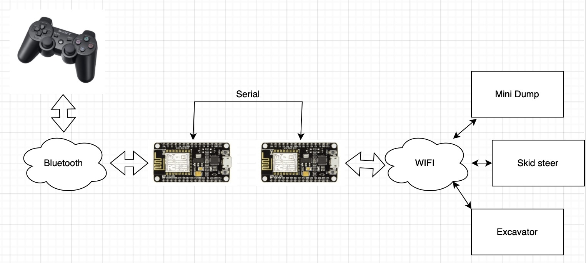
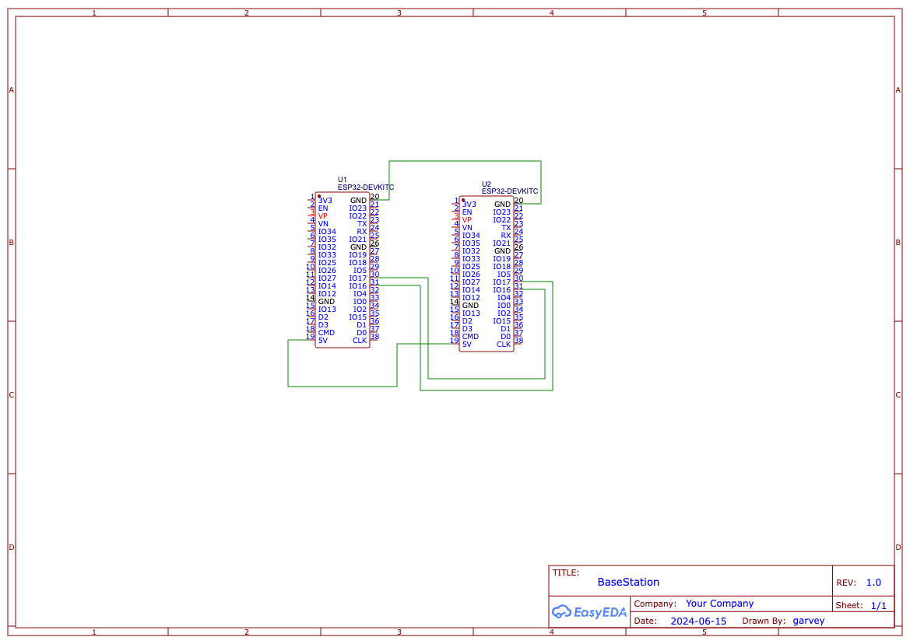

# Remote Control Basestation

This project implements a RC base station for the printable RC models from [ProfessorBoots][GithubProfBoots]. You connect with a PS3 controller to the base station. All models also connect to the base station. The base station will relay all input from the controller via WIFI to the models. You can switch between the models with the select button of the controller. So you dont need multiple controller or repair one controller with the model you want control. Simply start the base station connect the controller, start every model you have and play with them.

# Setup Brain MCU
Wire two Nodemcu like this

In the BaseStationBrainPS project you must setup the PS3 controller mac address.
Upload BaseStationBrainPS to the first Nodemcu and the BaseStationBrainWIFI project to the second Nodemcu. 

# Setup RC vehicle

For every vehicle MiniSkidi, MiniDump and Excavator there is a project which must be compiled and uploaded to the nodemcu of the vehicle. 

# Running

After uploaded every sketch, just switch the vehicle and power up the base station. Connect the PS3 controller and cycle through your vehicles with the select button.

[GithubProfBoots]: https://github.com/ProfBoots