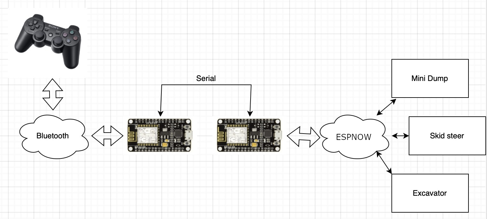
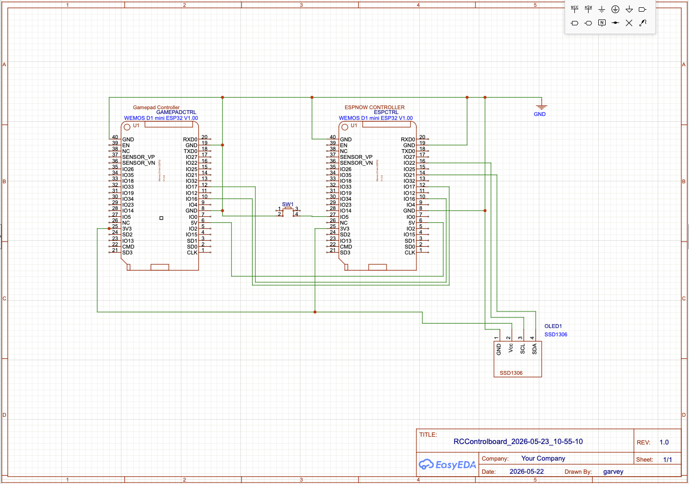

# Remote Control Basestation

A dual-ESP32 base station for RC models, designed to control multiple vehicles from a single -compatible gamepad.

The project uses Bluepad32 for the gamepad and a second ESP32 to broadcast control commands to all vehicles over ESPNOW. The base station tracks which vehicles are online, shows available vehicles on the display, and lets you switch control with a button press. This means you don’t need to re-pair each model when changing which vehicle you want to drive.



## Overview

- `gamepad_controller`: connects the  gamepad and reads input via Bluepad32.
- `espnow_controller`: receives the gamepad state from the gamepad controller over serial and sends commands to vehicles with ESPNOW.
- Vehicle projects: `MiniDumpV2`, `MiniSkiddi`, `Excavator`.


## Setup / Install / Upload controller firmware

This project uses PlatformIO. Upload the controller firmware with one of the following environments.

### Setup Base Station

Wire two NodeMCU boards as shown below.



The complete schematic is also available here:

[easyEda Project](https://oshwlab.com/smartandclever/project_vgmjmgea)

> [!WARNING] 
> I made a prototyp board for the controller. You can find the Gerber Files [here](PCB/Gerber_PCB_RCControlboard_2026-05-25.zip)\
> This is an early prototyp so use it at your own risk. I will test it and made a box which clips on the controller.

### Base station

- `gamepad_controller`: reads the  gamepad using Bluepad32.
- `espnow_controller`: sends ESPNOW packets to vehicles.

Example upload commands:

```bash
pio run -e gamepad_controller -t upload
pio run -e espnow_controller -t upload
```

### Vehicle firmware

Choose the correct vehicle environment for the model you are building:

- `MiniDumpV2`
- `MiniSkiddi`
- `Excavator`

Example upload command:

```bash
pio run -e MiniDumpV2 -t upload
```

### Upload notes

- Each environment has `upload_port` configured in `platformio.ini`.
- Make sure the correct ESP32 board is connected before uploading.
- If you change the USB serial port, update `upload_port` or provide `-P /dev/ttyUSB0` on the command line.


## Running

After uploading the firmware, power up the base station, connect the  controller, and power on the vehicles. Use the select button on the controller board to switch between available vehicles.

## Small Demo

[](https://youtu.be/WLLasP6-6oY) (Outdated old demo)

Thanks Professor Boots for these amazing models [GithubProfBoots](https://github.com/ProfBoots)

## TODOs
* Multiple Controller Support, so you can play with you kids together
* Printable attachment for a gamepad, so it can hold the board
* Add more models from Professor Boots (I am not sure whether I will build all :flushed: so I can test them. The wheel-loader and the dozer coming for sure)
* Maybe support for a bigger display (my eyes bleeding with these 1inch displays)  